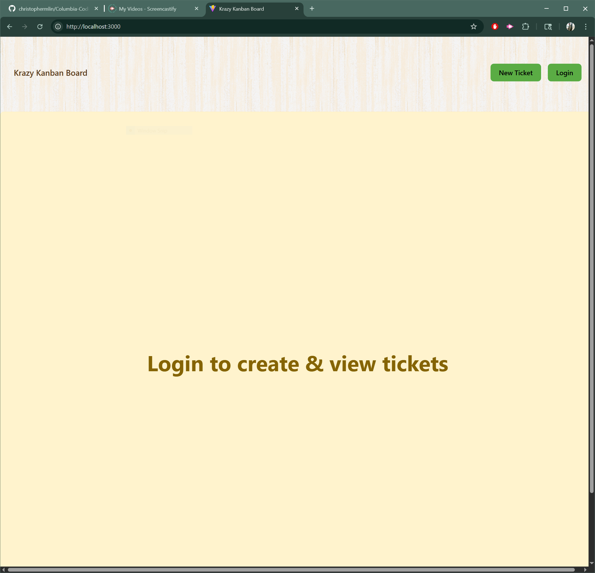
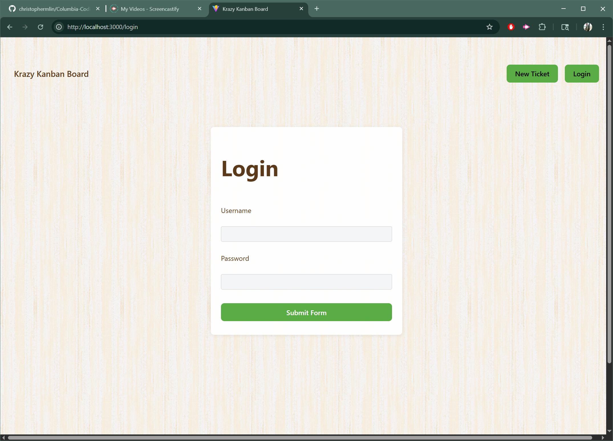
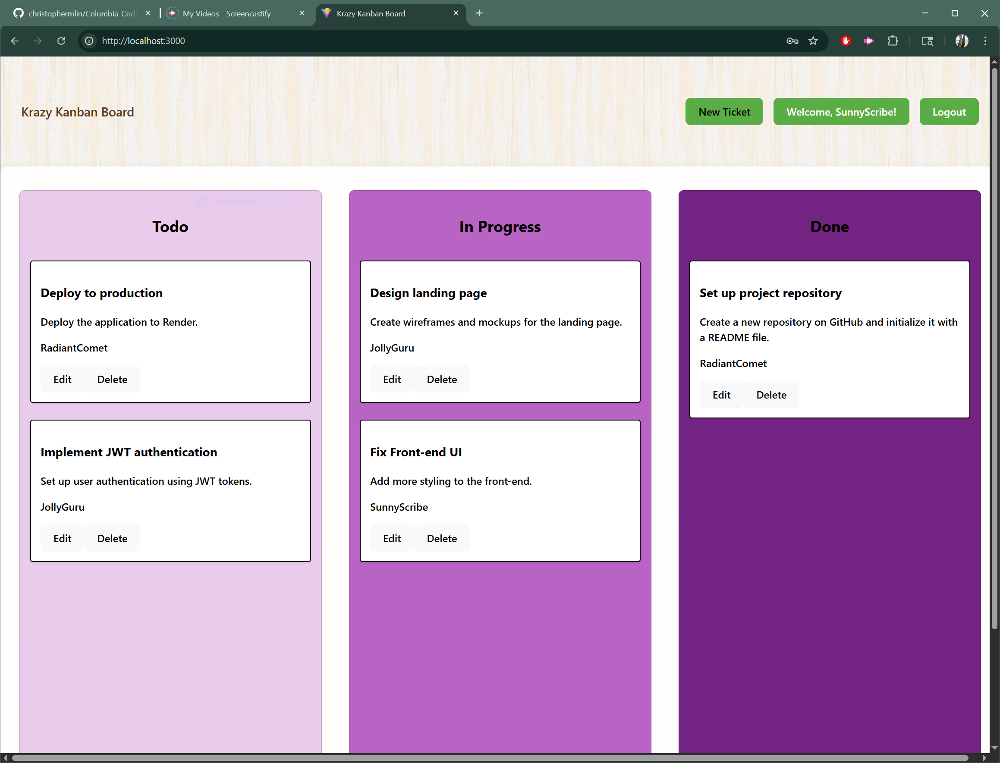

# Krazy Kanban Board – JWT Authentication Full-Stack Project

## Overview
This project is a full-stack Kanban board application built with React, TypeScript, Express, and PostgreSQL. It features secure authentication using JSON Web Tokens (JWT), allowing users to log in, manage tasks, and track work in a modern, visually appealing Kanban interface.

## Features
- **JWT Authentication:** Secure login and protected API routes using JWT.
- **User Login/Logout:** Users can log in with a username and password, and securely log out.
- **Kanban Board:** Tasks are displayed in columns (Todo, In Progress, Done) and can be managed by authenticated users.
- **Session Management:** JWT is stored in localStorage and automatically expires after a set period.
- **Personalized UI:** The Navbar displays a welcome message for the logged-in user.
- **Consistent Theme:** Modern, cohesive styling with a wood-inspired Kanban look.
- **Error Handling:** Clear error messages for failed logins and session expiration.

## How It Works
- **Login:** Enter your username and password to receive a JWT. The token is stored in localStorage and used for all subsequent API requests.
- **Protected Routes:** Only authenticated users can access the Kanban board and manage tickets. Unauthenticated users are redirected to the login page.
- **Ticket Creation:** New tickets are always attributed to the currently logged-in user.
- **Logout:** Logging out removes the JWT and redirects to the login page.

## Getting Started
1. **Install dependencies:**
   ```bash
   npm install
   ```
2. **Set up your `.env` file in the `server` folder:**
   ```env
   DB_NAME=kanban_db
   DB_USER=your_db_user
   DB_PASSWORD=your_db_password
   DB_HOST=localhost
   DB_PORT=5432
   JWT_SECRET=your_jwt_secret
   ```
3. **Seed the database:**
   ```bash
   npx ts-node src/seeds/index.ts
   ```
4. **Run the server and client:**
   ```bash
   # In one terminal (server)
   npm run dev
   # In another terminal (client)
   npm start
   ```
5. **Login with a seeded user:**
   - Username: `JollyGuru` | Password: `password`
   - Username: `SunnyScribe` | Password: `password`
   - Username: `RadiantComet` | Password: `password`

## Deployment
- The app is ready for deployment to Render or any platform supporting Node.js and PostgreSQL. Link: <https://columbia-coding-bootcamp-module-14.onrender.com>
- Set environment variables in your deployment platform as in your `.env` file.

## Screenshots

### Unauthenticated Page


### Login Page


### Main Page


### Additional Screenshots




---
© 2025 Christopher Lin. Bootcamp Full-Stack React Challenge.
